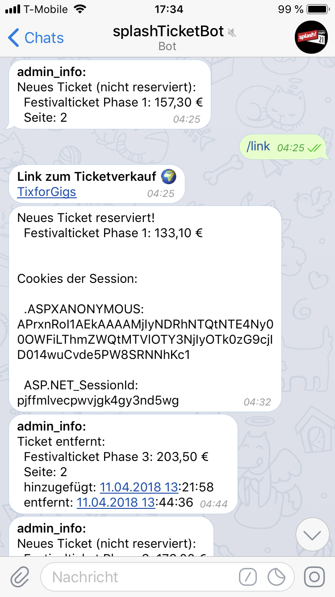

# ticketbot

### Functionality

This bot is able to make a quick reservation of a music festival ticket. The tickets are offered on a website, specifically made for legal ticket resales. The seller sets the price for the ticket and everybody who visits the website can make a reservation by adding the ticket to his/her shoppingcart. 

The bot pulls the website every few seconds (frequency dependent on the time of the day) and makes a reservation for tickets of the right kind and with an appropriate price.

The session cookies which the onlineshop uses to identify the user is then sent to my phone via telegram. I can then go ahead, add the cookies to my safari or firefox (they both store cookies in sqlite databases), reload the page and buy the tickets. 

The need to sit in front of the computer for hours and reload the page manually is thereby eliminated.

### Example

The bots answers are in german but here is a short explanation of what appens:

1. Bot informs the user about a new ticket. No reservation, ticket too expensive.
2. User requests the link to the shop.
3. Bot replies with the link.
4. The bot made a reservation of a new ticket with appropriate pricing. The user can now copy the cookies to safari.
5. Bot informs the user that another ticket was just removed from the sale.

### About the Festival

The festival is called splash! festival and is a hiphop festival in germany.

### Setup

The bot ran (while the ticket sale was active) an a server rented from Google. When starting to use Google Cloud Services every new customer gets a coupon worth 300$ which can be spend on any of their products.
